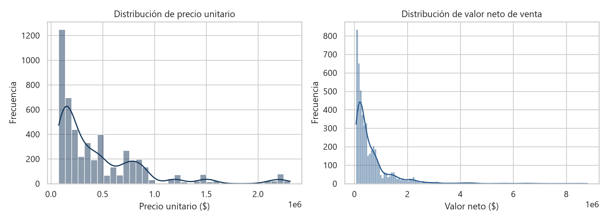
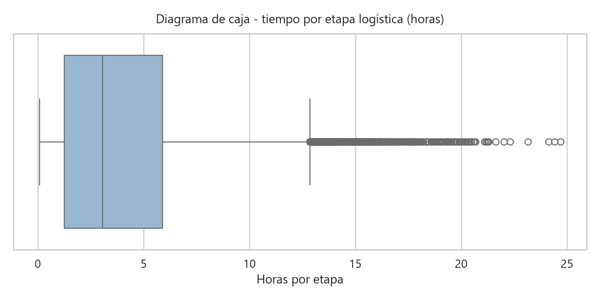
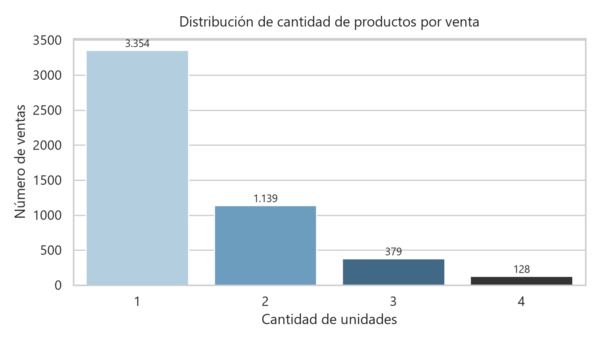
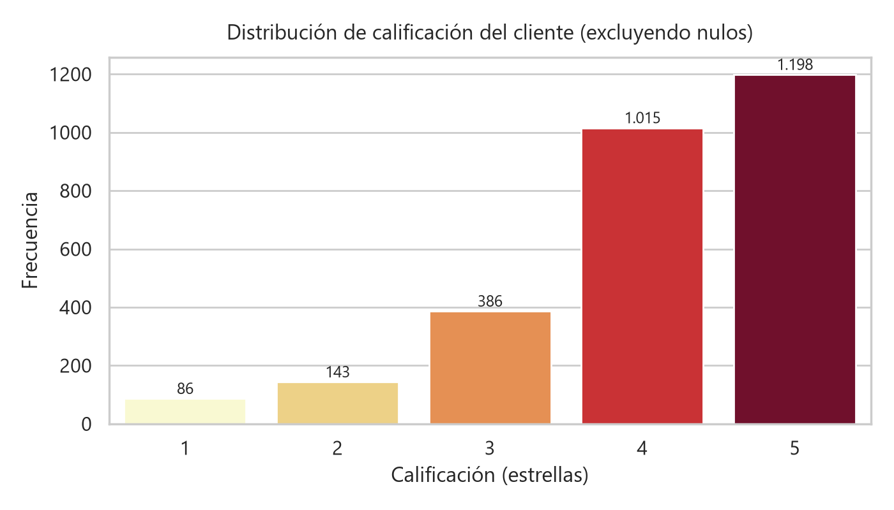

# Laboratorio ETL Kaismart Solutions S.A.S.

**Autores:** Miguel Ángel Méndez Rodríguez, Maicol Andrés Narváez Rincón, Karin Stephany Parra Rosero, Angie Tatiana Rodríguez Duque

Fuentes: base MySQL `clientes`, tabla `ventas` (`df_ventas`), y archivo `kaismart_eventos_logisticos.xlsx` (`df_logistica`). Las secciones 1 a 4 se calculan sobre los datos originales (capa Bronze), sin limpiar ni integrar.

---

## 1. Comprensión inicial de los datasets

### 1.1 Ventas (`df_ventas`)

**¿Qué representa una fila?** Una venta (transacción) de un cliente: un pedido_id con un producto, su cantidad, precios, descuento, canal, ciudad, medio de pago y la calificación opcional del cliente.

1. **Número de registros:** 5.000
2. **Número de variables:** 17
3. **Variables:** `id_venta`, `pedido_id`, `fecha_venta`, `id_cliente`, `ciudad`, `canal`, `id_tienda`, `categoria`, `producto`, `cantidad`, `precio_unitario`, `descuento_pct`, `valor_bruto`, `valor_descuento`, `valor_neto`, `medio_pago`, `calificacion_cliente`
4. y 5. **Tipo de dato y registros no nulos:** ver tabla.
6. **Identificadores:** `id_venta`, `pedido_id`, `id_cliente`, `id_tienda`
7. **Categóricas:** `ciudad`, `canal`, `categoria`, `producto`, `medio_pago`, `calificacion_cliente`
8. **Numéricas:** `cantidad`, `precio_unitario`, `descuento_pct`, `valor_bruto`, `valor_descuento`, `valor_neto`
9. **Fechas / tiempos:** `fecha_venta`
- **Rango de fechas:** `fecha_venta`: 2026-01-01 a 2026-06-30

| Variable | Tipo de dato | Registros no nulos | Clasificación | % nulos |
|---|---|---|---|---|
| id_venta | int64 | 5.000 | Identificador | 0,00% |
| pedido_id | str | 5.000 | Identificador | 0,00% |
| fecha_venta | datetime64[us] | 5.000 | Fecha | 0,00% |
| id_cliente | str | 5.000 | Identificador | 0,00% |
| ciudad | str | 5.000 | Categórica | 0,00% |
| canal | str | 5.000 | Categórica | 0,00% |
| id_tienda | str | 1.499 | Identificador | 70,02% |
| categoria | str | 5.000 | Categórica | 0,00% |
| producto | str | 5.000 | Categórica | 0,00% |
| cantidad | int64 | 5.000 | Numérica | 0,00% |
| precio_unitario | float64 | 5.000 | Numérica | 0,00% |
| descuento_pct | float64 | 5.000 | Numérica | 0,00% |
| valor_bruto | float64 | 5.000 | Numérica | 0,00% |
| valor_descuento | float64 | 5.000 | Numérica | 0,00% |
| valor_neto | float64 | 5.000 | Numérica | 0,00% |
| medio_pago | str | 5.000 | Categórica | 0,00% |
| calificacion_cliente | float64 | 2.828 | Categórica ordinal | 43,44% |

### 1.2 Logística (`df_logistica`)

**¿Qué representa una fila?** Un evento u hito del flujo logístico de un pedido (recibido, pago aprobado, alistamiento, despacho, tránsito, entrega...). Cada pedido_id tiene normalmente 10 eventos.

1. **Número de registros:** 50.000
2. **Número de variables:** 14
3. **Variables:** `evento_id`, `pedido_id`, `fecha_evento`, `estado_evento`, `centro_logistico`, `ciudad_destino`, `transportadora`, `numero_guia`, `fecha_prometida_entrega`, `tiempo_etapa_horas`, `costo_envio`, `incidencia`, `observacion`, `Unnamed: 13`
4. y 5. **Tipo de dato y registros no nulos:** ver tabla.
6. **Identificadores:** `evento_id`, `pedido_id`, `numero_guia`
7. **Categóricas:** `estado_evento`, `centro_logistico`, `ciudad_destino`, `transportadora`, `incidencia`, `observacion`
8. **Numéricas:** `tiempo_etapa_horas`, `costo_envio`
9. **Fechas / tiempos:** `fecha_evento`, `fecha_prometida_entrega`, `tiempo_etapa_horas`
- **Rango de fechas:** `fecha_evento`: 2026-01-01 a 2026-07-03 | `fecha_prometida_entrega`: 2026-01-03 a 2026-07-03

| Variable | Tipo de dato | Registros no nulos | Clasificación | % nulos |
|---|---|---|---|---|
| evento_id | int64 | 50.000 | Identificador | 0,00% |
| pedido_id | str | 50.000 | Identificador | 0,00% |
| fecha_evento | str | 49.935 | Fecha | 0,13% |
| estado_evento | str | 50.000 | Categórica | 0,00% |
| centro_logistico | str | 49.910 | Categórica | 0,18% |
| ciudad_destino | str | 49.955 | Categórica | 0,09% |
| transportadora | str | 19.912 | Categórica | 60,18% |
| numero_guia | str | 19.932 | Identificador | 60,14% |
| fecha_prometida_entrega | str | 49.945 | Fecha | 0,11% |
| tiempo_etapa_horas | float64 | 45.000 | Tiempo (duración numérica) | 10,00% |
| costo_envio | int64 | 50.000 | Numérica | 0,00% |
| incidencia | str | 511 | Categórica | 98,98% |
| observacion | str | 1.723 | Categórica | 96,55% |
| Unnamed: 13 | str | 1 | Columna residual | 100,00% |

### 1.3 Otros aspectos de calidad del dato

| Chequeo | Resultado |
|---|---|
| valor_bruto = precio_unitario × cantidad | 5.000 de 5.000 cumplen (0 inconsistentes) |
| valor_descuento = valor_bruto × descuento_pct / 100 | 5.000 de 5.000 cumplen (0 inconsistentes) |
| valor_neto = valor_bruto − valor_descuento | 5.000 de 5.000 cumplen (0 inconsistentes) |
| Valores negativos en variables numéricas | 0 |
| Integridad referencial por pedido_id | 0 ventas sin eventos logísticos; 0 pedidos logísticos sin venta |
| Ciudad de la venta vs ciudad_destino logística | 0 pedidos con ciudad distinta |
| Eventos por pedido | mín 8, máx 12, moda 10 |
| Pedidos que no pasan por los 10 estados | 98 pedidos con trazabilidad incompleta |
| costo_envio constante dentro de cada pedido | 5.000 de 5.000 pedidos (se repite en cada evento: no sumar por evento) |
| numero_guia compartido por pedidos distintos | 1: KMS64861259 |
| Fechas de logística almacenadas como texto | fecha_evento y fecha_prometida_entrega son str; 0 valores no convertibles a fecha |
| Columna residual del Excel | Unnamed: 13, con un único valor: ['=AI("")'] |
| Eventos con fecha anterior a la venta | 0 |
| Pedidos con fecha prometida igual o anterior a la venta | 0 |
| Pedidos con eventos fuera de orden cronológico (según evento_id) | 0 |
| Primer evento de cada pedido | Pedido recibido: 4.991, Pago aprobado: 9 |

## 2. Perfil inicial de calidad del dato

### 2.1 Valores nulos

#### Nulos en `df_ventas` (de mayor a menor)
| Variable | Cantidad nulos | Porcentaje (%) |
|---|---|---|
| id_tienda | 3.501 | 70,02% |
| calificacion_cliente | 2.172 | 43,44% |
| canal | 0 | 0,00% |
| cantidad | 0 | 0,00% |
| categoria | 0 | 0,00% |
| ciudad | 0 | 0,00% |
| descuento_pct | 0 | 0,00% |
| fecha_venta | 0 | 0,00% |
| id_cliente | 0 | 0,00% |
| id_venta | 0 | 0,00% |
| medio_pago | 0 | 0,00% |
| pedido_id | 0 | 0,00% |
| precio_unitario | 0 | 0,00% |
| producto | 0 | 0,00% |
| valor_bruto | 0 | 0,00% |
| valor_descuento | 0 | 0,00% |
| valor_neto | 0 | 0,00% |

#### Nulos en `df_logistica` (de mayor a menor)
| Variable | Cantidad nulos | Porcentaje (%) |
|---|---|---|
| Unnamed: 13 | 49.999 | 99,998% |
| incidencia | 49.489 | 98,978% |
| observacion | 48.277 | 96,554% |
| transportadora | 30.088 | 60,176% |
| numero_guia | 30.068 | 60,136% |
| tiempo_etapa_horas | 5.000 | 10,000% |
| centro_logistico | 90 | 0,180% |
| fecha_evento | 65 | 0,130% |
| fecha_prometida_entrega | 55 | 0,110% |
| ciudad_destino | 45 | 0,090% |
| costo_envio | 0 | 0,000% |
| estado_evento | 0 | 0,000% |
| evento_id | 0 | 0,000% |
| pedido_id | 0 | 0,000% |

#### Interpretación: nulos normales del proceso vs. problemas de calidad
| DataFrame | Variable | Tipo de nulo | Interpretación |
|---|---|---|---|
| df_ventas | id_tienda | Normal | Es nulo en 3.501 de 3.501 ventas web/app y en 0 de 1.499 ventas en tienda física: solo aplica a tienda física. |
| df_ventas | calificacion_cliente | Normal | Calificar es opcional para el cliente. Debe tenerse en cuenta que los promedios solo representan a quien calificó. |
| df_logistica | transportadora / numero_guia | Normal antes del despacho | Nulos antes del despacho: 30.008 / 30.008 (el 100% de esos eventos): aún no hay transporte asignado. |
| df_logistica | transportadora / numero_guia | Problema | Nulos en estados de transporte (Despachado en adelante): 80 / 60. Un pedido despachado debe tener transportadora y guía. |
| df_logistica | tiempo_etapa_horas | Normal | Los 5.000 nulos están en: Pedido recibido (5.000). Es el primer evento y no tiene etapa previa. |
| df_logistica | incidencia | Normal | Solo se registra cuando hay una novedad. |
| df_logistica | observacion | Normal | Solo se registra cuando hay algo que anotar (1.212 observaciones existen sin incidencia). |
| df_logistica | centro_logistico, ciudad_destino, fecha_prometida_entrega | Problema | Son datos del pedido y deben existir en todos sus eventos (son constantes dentro del pedido). |
| df_logistica | fecha_evento | Problema | Todo evento ocurrido debe tener fecha y hora. |
| df_logistica | Unnamed: 13 | Problema (columna residual) | 49.999 nulos de 50.000: columna sin nombre que no pertenece al modelo de datos. |

En esta etapa no se elimina ni se imputa ningún valor.

### 2.2 Valores únicos y cardinalidad (`nunique()`)

#### Cardinalidad en `df_ventas`
| Variable | Clasificación | Valores únicos | % sobre registros | Evaluación |
|---|---|---|---|---|
| id_venta | Identificador | 5.000 | 100,00% | Identificador único |
| pedido_id | Identificador | 5.000 | 100,00% | Identificador único |
| fecha_venta | Fecha | 5.000 | 100,00% | Fecha (casi única por registro) |
| id_cliente | Identificador | 2.292 | 45,84% | Identificador con repetidos (alta cardinalidad) |
| valor_neto | Numérica | 1.325 | 26,50% | Numérica continua |
| valor_descuento | Numérica | 693 | 13,86% | Numérica continua |
| valor_bruto | Numérica | 448 | 8,96% | Numérica continua |
| precio_unitario | Numérica | 133 | 2,66% | Numérica continua |
| producto | Categórica | 30 | 0,60% | Cardinalidad media |
| id_tienda | Identificador | 10 | 0,20% | Clave que se repite (~149,9 filas por valor) |
| medio_pago | Categórica | 6 | 0,12% | Baja cardinalidad (pocos valores posibles) |
| ciudad | Categórica | 6 | 0,12% | Baja cardinalidad (pocos valores posibles) |
| categoria | Categórica | 5 | 0,10% | Baja cardinalidad (pocos valores posibles) |
| calificacion_cliente | Categórica ordinal | 5 | 0,10% | Baja cardinalidad (pocos valores posibles) |
| descuento_pct | Numérica | 5 | 0,10% | Numérica discreta (pocos valores) |
| cantidad | Numérica | 4 | 0,08% | Numérica discreta (pocos valores) |
| canal | Categórica | 3 | 0,06% | Baja cardinalidad (pocos valores posibles) |

#### Cardinalidad en `df_logistica`
| Variable | Clasificación | Valores únicos | % sobre registros | Evaluación |
|---|---|---|---|---|
| evento_id | Identificador | 49.900 | 99,80% | Identificador con repetidos (alta cardinalidad) |
| fecha_evento | Fecha | 49.765 | 99,53% | Fecha (casi única por registro) |
| pedido_id | Identificador | 5.000 | 10,00% | Clave que se repite (~10,0 filas por valor) |
| numero_guia | Identificador | 4.999 | 10,00% | Clave que se repite (~4,0 filas por valor) |
| fecha_prometida_entrega | Fecha | 4.999 | 10,00% | Fecha que se repite |
| tiempo_etapa_horas | Tiempo (duración numérica) | 1.748 | 3,50% | Numérica continua |
| costo_envio | Numérica | 12 | 0,02% | Numérica discreta (pocos valores) |
| estado_evento | Categórica | 10 | 0,02% | Baja cardinalidad (pocos valores posibles) |
| observacion | Categórica | 9 | 0,02% | Baja cardinalidad (pocos valores posibles) |
| centro_logistico | Categórica | 6 | 0,01% | Baja cardinalidad (pocos valores posibles) |
| ciudad_destino | Categórica | 6 | 0,01% | Baja cardinalidad (pocos valores posibles) |
| incidencia | Categórica | 6 | 0,01% | Baja cardinalidad (pocos valores posibles) |
| transportadora | Categórica | 5 | 0,01% | Baja cardinalidad (pocos valores posibles) |
| Unnamed: 13 | Columna residual | 1 | 0,00% | Sin información útil |

- **`id_venta`:** 5.000 valores para 5.000 filas. Es el identificador único de la venta.
- **`pedido_id`:** único en ventas (5.000), pero en logística se repite (~10 eventos por pedido). Es la clave para integrar las fuentes (relación 1 a muchos).
- **`evento_id`:** 49.900 valores para 50.000 filas. Debería ser único, así que hay 100 repetidos (ver 2.3).
- **Alta cardinalidad:** `id_cliente` (2.292 clientes; hay clientes que compran varias veces). `producto` (30 valores) tiene cardinalidad media.
- **Baja cardinalidad (pocos valores posibles):** `canal`, `ciudad`, `categoria`, `medio_pago`, `calificacion_cliente`, `estado_evento`, `centro_logistico`, `ciudad_destino`, `transportadora`, `incidencia` y `observacion`. Son ideales para agrupar.
- **Numéricas discretas:** `cantidad` (4 valores), `descuento_pct` (5) y `costo_envio` (12 tarifas) toman pocos valores.

### 2.3 Duplicados

| Revisión | df_ventas | df_logistica |
|---|---|---|
| Filas completamente duplicadas | 0 | 99 |
| `id_venta` repetidos | 0 | - |
| `pedido_id` repetidos | 0 | 45.000 (esperado: varios eventos por pedido) |
| `evento_id` repetidos | - | 100 |
| `numero_guia` compartido por pedidos distintos | - | 1 (`KMS64861259`) |

- **Ventas:** no hay duplicados. Cada venta es un pedido único (relación 1 a 1 entre `id_venta` y `pedido_id`).
- **Logística:** de los 100 `evento_id` repetidos, 99 son filas idénticas (el mismo evento cargado dos veces) y 1 tiene contenido distinto: `evento_id` 35782 difiere solo en `centro_logistico`. Se conservará la fila más completa.
- **Guía compartida:** `KMS64861259` aparece en los pedidos `PED002818`, `PED003984`. Una guía debería identificar a un solo envío.
- No se elimina ningún duplicado en esta etapa.

### 2.4 Coherencia de tipos de datos

#### Tipos en `df_ventas`
| Variable | Tipo detectado | Diagnóstico |
|---|---|---|
| id_venta | int64 | OK: clave técnica entera (no se opera aritméticamente) |
| pedido_id | str | OK (texto) |
| fecha_venta | datetime64[us] | OK (datetime) |
| id_cliente | str | OK (texto) |
| ciudad | str | OK (texto) |
| canal | str | OK (texto) |
| id_tienda | str | OK (texto) |
| categoria | str | OK (texto) |
| producto | str | OK (texto) |
| cantidad | int64 | OK (numérica) |
| precio_unitario | float64 | OK (monetaria numérica) |
| descuento_pct | float64 | OK (numérica) |
| valor_bruto | float64 | OK (monetaria numérica) |
| valor_descuento | float64 | OK (monetaria numérica) |
| valor_neto | float64 | OK (monetaria numérica) |
| medio_pago | str | OK (texto) |
| calificacion_cliente | float64 | REVISAR: escala entera 1-5 almacenada como float64 por los nulos; usar Int64 |

#### Tipos en `df_logistica`
| Variable | Tipo detectado | Diagnóstico |
|---|---|---|
| evento_id | int64 | OK: clave técnica entera (no se opera aritméticamente) |
| pedido_id | str | OK (texto) |
| fecha_evento | str | REVISAR: fecha almacenada como str, convertir a datetime |
| estado_evento | str | OK (texto) |
| centro_logistico | str | OK (texto) |
| ciudad_destino | str | OK (texto) |
| transportadora | str | OK (texto) |
| numero_guia | str | OK (texto) |
| fecha_prometida_entrega | str | REVISAR: fecha almacenada como str, convertir a datetime |
| tiempo_etapa_horas | float64 | OK: duración en horas (numérica), no es una fecha |
| costo_envio | int64 | OK (monetaria numérica) |
| incidencia | str | OK (texto) |
| observacion | str | OK (texto) |
| Unnamed: 13 | str | REVISAR: eliminar (no pertenece al modelo de datos) |

**Columnas a revisar antes de analizar:** `fecha_evento` y `fecha_prometida_entrega` (texto, se deben convertir a datetime), `calificacion_cliente` (float por los nulos, es una escala entera), `Unnamed: 13` (residual), y `costo_envio`, que se repite en cada evento del pedido y no debe sumarse por evento. Los montos son numéricos y los identificadores de texto son coherentes; `id_venta` y `evento_id` son claves técnicas enteras, así que no se opera con ellas.

## 3. Estadísticos descriptivos y resúmenes

### 3.1 Variables numéricas

#### `df_ventas`
| Variable | Count | Media | Std | Min | P25 | Mediana | P75 | Max |
|---|---|---|---|---|---|---|---|---|
| cantidad | 5.000 | 1,46 | 0,74 | 1,00 | 1,00 | 1,00 | 2,00 | 4,00 |
| precio_unitario | 5.000 | 455.950,16 | 445.808,47 | 75.900,00 | 142.400,00 | 289.900,00 | 685.900,00 | 2.309.900,00 |
| descuento_pct | 5.000 | 5,28 | 6,12 | 0,00 | 0,00 | 5,00 | 10,00 | 20,00 |
| valor_bruto | 5.000 | 668.288,12 | 828.903,83 | 75.900,00 | 188.800,00 | 391.800,00 | 807.400,00 | 8.799.600,00 |
| valor_descuento | 5.000 | 34.593,10 | 79.018,31 | 0,00 | 0,00 | 5.495,00 | 35.970,00 | 1.671.920,00 |
| valor_neto | 5.000 | 633.695,02 | 788.075,29 | 63.920,00 | 176.310,00 | 367.110,00 | 764.915,00 | 8.799.600,00 |

Los montos tienen asimetría positiva: la media de `valor_neto` (633.695) casi duplica la mediana (367.110), porque pocas ventas de valor alto elevan el promedio. Para este tipo de variable, la mediana es la medida central más representativa.

#### `df_logistica`
| Variable | Count | Media | Std | Min | P25 | Mediana | P75 | Max |
|---|---|---|---|---|---|---|---|---|
| tiempo_etapa_horas | 45.000 | 4,00 | 3,46 | 0,08 | 1,25 | 3,05 | 5,89 | 24,69 |
| costo_envio | 50.000 | 13.609,49 | 3.607,86 | 8.900,00 | 9.900,00 | 13.900,00 | 15.900,00 | 20.790,00 |

`costo_envio` está calculado por evento. Por pedido (un valor por pedido) la media es 13.611.

### 3.2 Variables categóricas

#### Resumen general
| DataFrame | Variable | Valores únicos | Categoría más frecuente | Frecuencia | % de no nulos | Categorías |
|---|---|---|---|---|---|---|
| df_ventas | ciudad | 6 | Bogotá D.C. | 1.653 | 33,1% | Bogotá D.C., Cali, Medellín, Barranquilla, Bucaramanga, Pereira |
| df_ventas | canal | 3 | Página web | 2.020 | 40,4% | Página web, Tienda física, Aplicación móvil |
| df_ventas | categoria | 5 | Tecnología | 1.366 | 27,3% | Tecnología, Electrodomésticos, Hogar, Deportes, Oficina |
| df_ventas | producto | 30 | Monitor 24 pulgadas | 243 | 4,9% | Monitor 24 pulgadas, Audífonos Bluetooth, Smartwatch, Mouse inalámbrico, Teclado mecánico, Tablet 10 pulgadas, Cafetera eléctrica, Freidora de aire, Arrocera, Horno microondas, Licuadora, Lámpara de mesa, Sanduchera, Aspiradora vertical, Purificador de aire, Juego de ollas, Kit bandas elásticas, Organizador modular, Ventilador de torre, Impresora multifuncional, Archivador metálico, Banda caminadora, Base para portátil, Mancuernas ajustables, Bicicleta estática, Balón fútbol, Colchoneta yoga, Silla ergonómica, Escritorio ajustable, Webcam Full HD |
| df_ventas | medio_pago | 6 | Tarjeta crédito | 1.888 | 37,8% | Tarjeta crédito, PSE, Tarjeta débito, Efectivo, Billetera digital, Transferencia |
| df_ventas | calificacion_cliente | 5 | 5.0 | 1.198 | 42,4% | 5.0, 4.0, 3.0, 2.0, 1.0 |
| df_logistica | estado_evento | 10 | Listo para despacho | 5.006 | 10,0% | Listo para despacho, Despachado, Orden enviada a logística, En alistamiento, Pedido recibido, Pago aprobado, Empacado, En tránsito, Entregado, En ruta de entrega |
| df_logistica | centro_logistico | 6 | CEDI Bogotá | 16.491 | 33,0% | CEDI Bogotá, CEDI Cali, CEDI Medellín, CEDI Barranquilla, CEDI Bucaramanga, CEDI Pereira |
| df_logistica | ciudad_destino | 6 | Bogotá D.C. | 16.510 | 33,0% | Bogotá D.C., Cali, Medellín, Barranquilla, Bucaramanga, Pereira |
| df_logistica | transportadora | 5 | Envia | 4.216 | 21,2% | Envia, Coordinadora, Inter Rapidísimo, TCC, Servientrega |
| df_logistica | incidencia | 6 | Error de clasificación | 98 | 19,2% | Error de clasificación, Cliente ausente, Novedad climática, Retraso por tráfico, Paquete reprogramado, Dirección incompleta |
| df_logistica | observacion | 9 | Validación realizada sin novedades. | 412 | 23,9% | Validación realizada sin novedades., Seguimiento automático registrado por el sistema., Pedido procesado dentro de la ventana prevista., El paquete fue redireccionado al centro logístico correcto., Se programó un nuevo intento de entrega., La operación se retrasó por condiciones climáticas., La ruta presentó congestión superior a la esperada., El cliente solicitó cambio de fecha de entrega., Se solicitó validación de dirección al cliente. |

#### `df_ventas`: ventas por ciudad
| ciudad | registros | % |
|---|---|---|
| Bogotá D.C. | 1.653 | 33,1% |
| Cali | 942 | 18,8% |
| Medellín | 919 | 18,4% |
| Barranquilla | 534 | 10,7% |
| Bucaramanga | 513 | 10,3% |
| Pereira | 439 | 8,8% |

#### `df_ventas`: ventas por canal
| canal | registros | % |
|---|---|---|
| Página web | 2.020 | 40,4% |
| Tienda física | 1.499 | 30,0% |
| Aplicación móvil | 1.481 | 29,6% |

#### `df_ventas`: ventas por categoría
| categoria | registros | % |
|---|---|---|
| Tecnología | 1.366 | 27,3% |
| Electrodomésticos | 1.104 | 22,1% |
| Hogar | 935 | 18,7% |
| Deportes | 812 | 16,2% |
| Oficina | 783 | 15,7% |

#### `df_ventas`: distribución de la cantidad de productos vendidos
| cantidad | registros | % |
|---|---|---|
| 1 | 3.354 | 67,1% |
| 2 | 1.139 | 22,8% |
| 3 | 379 | 7,6% |
| 4 | 128 | 2,6% |

#### `df_ventas`: resumen de `precio_unitario`, `valor_bruto`, `valor_descuento` y `valor_neto`
| Variable | Count | Media | Std | Min | P25 | Mediana | P75 | Max |
|---|---|---|---|---|---|---|---|---|
| precio_unitario | 5.000 | 455.950,16 | 445.808,47 | 75.900,00 | 142.400,00 | 289.900,00 | 685.900,00 | 2.309.900,00 |
| valor_bruto | 5.000 | 668.288,12 | 828.903,83 | 75.900,00 | 188.800,00 | 391.800,00 | 807.400,00 | 8.799.600,00 |
| valor_descuento | 5.000 | 34.593,10 | 79.018,31 | 0,00 | 0,00 | 5.495,00 | 35.970,00 | 1.671.920,00 |
| valor_neto | 5.000 | 633.695,02 | 788.075,29 | 63.920,00 | 176.310,00 | 367.110,00 | 764.915,00 | 8.799.600,00 |

#### `df_ventas`: distribución de `calificacion_cliente` (2.828 registros con información)
| calificacion | registros | % |
|---|---|---|
| 5 | 1.198 | 42,4% |
| 4 | 1.015 | 35,9% |
| 3 | 386 | 13,6% |
| 2 | 143 | 5,1% |
| 1 | 86 | 3,0% |

#### `df_logistica`: eventos por `estado_evento`
| estado_evento | registros | % |
|---|---|---|
| Listo para despacho | 5.006 | 10,0% |
| Despachado | 5.005 | 10,0% |
| Orden enviada a logística | 5.004 | 10,0% |
| En alistamiento | 5.001 | 10,0% |
| Pedido recibido | 5.000 | 10,0% |
| Pago aprobado | 4.999 | 10,0% |
| Empacado | 4.998 | 10,0% |
| En tránsito | 4.998 | 10,0% |
| Entregado | 4.998 | 10,0% |
| En ruta de entrega | 4.991 | 10,0% |

#### `df_logistica`: eventos por `ciudad_destino`
| ciudad_destino | registros | % |
|---|---|---|
| Bogotá D.C. | 16.510 | 33,0% |
| Cali | 9.412 | 18,8% |
| Medellín | 9.186 | 18,4% |
| Barranquilla | 5.331 | 10,7% |
| Bucaramanga | 5.128 | 10,3% |
| Pereira | 4.388 | 8,8% |

#### `df_logistica`: frecuencia de transportadoras (eventos)
| transportadora | registros | % |
|---|---|---|
| Envia | 4.216 | 21,2% |
| Coordinadora | 4.097 | 20,6% |
| Inter Rapidísimo | 4.008 | 20,1% |
| TCC | 3.810 | 19,1% |
| Servientrega | 3.781 | 19,0% |

#### `df_logistica`: frecuencia de incidencias
| incidencia | registros | % |
|---|---|---|
| Error de clasificación | 98 | 19,2% |
| Cliente ausente | 91 | 17,8% |
| Novedad climática | 91 | 17,8% |
| Retraso por tráfico | 81 | 15,9% |
| Paquete reprogramado | 76 | 14,9% |
| Dirección incompleta | 74 | 14,5% |

#### `df_logistica`: resumen de `tiempo_etapa_horas` y `costo_envio`
| Variable | Count | Media | Std | Min | P25 | Mediana | P75 | Max |
|---|---|---|---|---|---|---|---|---|
| tiempo_etapa_horas | 45.000 | 4,00 | 3,46 | 0,08 | 1,25 | 3,05 | 5,89 | 24,69 |
| costo_envio | 50.000 | 13.609,49 | 3.607,86 | 8.900,00 | 9.900,00 | 13.900,00 | 15.900,00 | 20.790,00 |

## 4. Preguntas de negocio (datos originales)

**1. ¿Cuál es el canal con mayor venta neta acumulada?**

Página web, con $1.286.922.005 (40,6% del total).

| canal | valor_neto |
|---|---|
| Página web | 1.286.922.005 |
| Tienda física | 955.272.420 |
| Aplicación móvil | 926.280.655 |

**2. ¿Cuál es la categoría con mayor número de productos vendidos en Bogotá D.C.?**

Tecnología, con 650 unidades. Sin embargo, en valor neto lidera Deportes ($273.790.785): vende menos unidades, pero más caras.

| categoria | unidades | valor_neto |
|---|---|---|
| Deportes | 379 | 273.790.785 |
| Electrodomésticos | 507 | 145.291.150 |
| Hogar | 437 | 157.488.760 |
| Oficina | 385 | 216.705.250 |
| Tecnología | 650 | 240.385.895 |

**3. ¿Qué tan recurrentes son los clientes?**

De 2.292 clientes, 1.458 (63,6%) compraron más de una vez y generan el 83,3% de las ventas. El cliente más frecuente compró 9 veces.

| compras_por_cliente | clientes |
|---|---|
| 1 | 834 |
| 2 | 696 |
| 3 | 437 |
| 4 | 211 |
| 5 | 81 |
| 6 | 22 |
| 7 | 7 |
| 8 | 3 |
| 9 | 1 |

**4. ¿Qué porcentaje representa el valor_descuento frente al valor_bruto?**

5,18% del valor bruto total; el 51,3% de las ventas tuvo algún descuento.

**5. ¿Cuál es el tiempo medio por etapa logística según la transportadora?**

Entre 6,45 h (Servientrega) y 6,58 h (Inter Rapidísimo): no hay diferencias relevantes. Solo incluye etapas de transporte; el promedio de todas las etapas es 4,00 h.

| transportadora | tiempo_etapa_horas |
|---|---|
| Servientrega | 6,45 |
| Coordinadora | 6,46 |
| TCC | 6,46 |
| Envia | 6,47 |
| Inter Rapidísimo | 6,58 |

**6. ¿Qué producto genera el mayor valor neto y cuánto pesa en su categoría?**

Banda caminadora (Deportes), con $442.828.885, frente a $296.333.820 del segundo (Bicicleta estática). Aporta el 51,3% del valor neto de Deportes, y explica por qué esa categoría lidera en valor aunque no en número de transacciones.

| producto | categoria | valor_neto |
|---|---|---|
| Banda caminadora | Deportes | 442.828.885 |
| Bicicleta estática | Deportes | 296.333.820 |
| Tablet 10 pulgadas | Tecnología | 278.582.910 |
| Monitor 24 pulgadas | Tecnología | 231.554.560 |
| Escritorio ajustable | Oficina | 192.232.905 |

**7. ¿El costo de envío depende de la ciudad destino, la categoría o el tamaño del pedido?**

No. Las 12 tarifas aparecen en todas las ciudades, el costo promedio por ciudad varía entre $13.440 y $13.773, y por categoría entre $13.483 y $13.767. La correlación con la cantidad es -0,005 y con el valor neto 0,003. La tarifa no refleja el destino ni el pedido.

| ciudad_destino | costo_promedio | tarifas_distintas |
|---|---|---|
| Barranquilla | 13.440 | 12 |
| Bogotá D.C. | 13.667 | 12 |
| Bucaramanga | 13.477 | 12 |
| Cali | 13.773 | 12 |
| Medellín | 13.485 | 12 |
| Pereira | 13.681 | 12 |

**8. ¿Qué porcentaje de los eventos presenta una incidencia registrada?**

1,02% de los eventos (511), que afectan a 511 pedidos (10,2%).

**9. ¿Cómo se relaciona el medio de pago con el canal de venta?**

Hay medios exclusivos de un canal: Billetera digital solo en Aplicación móvil; Efectivo solo en Tienda física; Transferencia solo en Página web. PSE, Tarjeta crédito, Tarjeta débito se usan en más de un canal. La combinación es coherente con el negocio: no hay pagos en efectivo en canales digitales.

| medio_pago | Aplicación móvil | Página web | Tienda física |
|---|---|---|---|
| Billetera digital | 230 | 0 | 0 |
| Efectivo | 0 | 0 | 421 |
| PSE | 432 | 657 | 138 |
| Tarjeta crédito | 553 | 833 | 502 |
| Tarjeta débito | 266 | 385 | 438 |
| Transferencia | 0 | 145 | 0 |

**10. ¿Cuál es el valor neto promedio por transacción en cada ciudad?**

Mayor en Bucaramanga ($678.115) y menor en Pereira ($559.717).

| ciudad | valor_neto |
|---|---|
| Bucaramanga | 678.115 |
| Cali | 654.120 |
| Medellín | 639.395 |
| Barranquilla | 631.910 |
| Bogotá D.C. | 625.325 |
| Pereira | 559.717 |

## 5. Transformación de datos (Medallion)

| Capa | Contenido | Archivos |
|---|---|---|
| Bronze | Copia exacta de las fuentes: última carga y un histórico por ejecución con el `.xlsx` original sin tocar | `ventas_bronze.parquet` (5.000 × 17), `logistica_bronze.parquet` (50.000 × 14), `historico/` (1 carga) |
| Silver | Se construye **leyendo Bronze**. Datos depurados por fuente, registro de incidencias y cuarentena | `df_ventas_transformado.parquet` (5.000 × 17), `df_logistica_transformado.parquet` (49.900 × 13), `incidencias_calidad.parquet` (601), `rechazados/` (0) |
| Gold | Integración por `pedido_id` y tablas agregadas listas para consumo | `ventas_logistica_gold.parquet` (1 fila por pedido, 5.000 × 38), `eventos_gold.parquet` (1 fila por evento, 49.900 × 25), `kpi_mensual`, `desempeno_transportadora`, `ventas_ciudad_canal` |

### 5.1 Duplicados

- Se eliminaron 99 filas idénticas en logística. En ventas no había duplicados.
- Se resolvió 1 `evento_id` repetido con contenido distinto conservando la fila con menos nulos (las dos versiones solo difieren en `centro_logistico` para el evento 35782).
- Resultado: `evento_id` es único en Silver (49.900 valores para 49.900 filas).

### 5.2 Tratamiento de nulos (cada decisión es explícita, no automática)

#### Logística
| Variable | Nulos Bronze | Estrategia | Justificación | Nulos Silver |
|---|---|---|---|---|
| fecha_evento | 65 | Se mantiene nulo | No se puede deducir la hora real de un evento; imputarla alteraría tiempos y retrasos. | 65 |
| centro_logistico | 90 | Valor del mismo pedido | Es constante dentro del pedido (1 valor por pedido), así que se recupera el valor real. Es más exacto que la moda. | 0 |
| ciudad_destino | 45 | Valor del mismo pedido | Es constante dentro del pedido y coincide con la ciudad de la venta. | 0 |
| transportadora | 30.088 | Valor del mismo pedido, solo en estados de transporte | Antes del despacho el nulo es válido y se mantiene. En Despachado, En tránsito, En ruta de entrega, Entregado se completa con la transportadora del pedido (cada pedido tiene una sola). | 29.944 |
| numero_guia | 30.068 | Valor del mismo pedido, solo en estados de transporte | Igual que `transportadora`: cada pedido tiene una sola guía. | 29.944 |
| fecha_prometida_entrega | 55 | Valor del mismo pedido | Es constante dentro del pedido, así que se recupera el valor real. | 0 |
| tiempo_etapa_horas | 5.000 | Se mantiene nulo | Todos los nulos están en `Pedido recibido`, el primer evento, que no tiene etapa previa. Imputar media o mediana inventaría una duración que no existe. | 4.991 |
| incidencia | 49.489 | Categoría `Sin incidencia` | El nulo significa que no hubo novedad; se hace explícito (equivale a "NO INFORMADO"). | 0 |
| observacion | 48.277 | Categoría `Sin observación` | El nulo significa que no se anotó nada; se hace explícito. | 0 |
| Unnamed: 13 | 49.999 | Eliminar columna | Columna residual del Excel (una sola celda con la fórmula `=AI("")`). | eliminada |

En estados de transporte, `transportadora` pasó de 80 a 0 nulos y `numero_guia` de 60 a 0. Los nulos que quedan son todos de eventos anteriores al despacho, donde son válidos.

#### Ventas
| Variable | Nulos Bronze | Estrategia | Justificación | Nulos Silver |
|---|---|---|---|---|
| id_tienda | 3.501 | Se mantiene nulo | Solo aplica al canal Tienda física; en web y app no existe tienda. | 3.501 |
| calificacion_cliente | 2.172 | Se mantiene nulo (tipo Int64) | El cliente no calificó. Imputar moda (5) o media inflaría o distorsionaría la satisfacción. | 2.172 |

No se usó media ni mediana porque ninguna variable numérica tiene nulos que sean errores. Los únicos nulos numéricos (`tiempo_etapa_horas` y `calificacion_cliente`) tienen un significado válido. Tampoco se usó la moda para las categóricas: el valor real se podía recuperar del mismo pedido, y eso es más exacto.

### 5.3 Tipos y estandarización

- `fecha_evento` y `fecha_prometida_entrega` pasan de texto a `datetime`; `fecha_venta` ya era `datetime`.
- `calificacion_cliente` pasa de `float64` a `Int64` (entero que admite nulos).
- En las variables de texto se eliminaron espacios al inicio y al final y se colapsaron los espacios repetidos (0 valores cambiaron). Al validar contra la cobertura de `config.yaml` (Bogotá D.C., Cali, Medellín, Barranquilla, Bucaramanga, Pereira), todas las ciudades están dentro de la cobertura, y no hay variantes de escritura de una misma categoría (mayúsculas, tildes o espacios), así que no fue necesario recodificar.
- Se eliminó la columna residual `Unnamed: 13`.

### 5.4 Capa Gold

`ventas_logistica_gold` agrega una fila por pedido con la venta y su resumen logístico: número de eventos y estados, estado final, transportadora, costo de envío (una vez por pedido), tiempo total, incidencias, fecha de entrega, `dias_retraso`, `entregado_tarde`, `trazabilidad_completa`, `guia_compartida`, `entregado`, `dias_ciclo_entrega` (de la venta a la entrega), `dias_prometidos` (de la venta a la fecha prometida) y `mes_venta`.

`eventos_gold` (49.900 × 25) tiene una fila por evento con los datos descriptivos de la venta, **sin los montos de la venta** (`precio_unitario`, `valor_bruto`, `valor_descuento`, `valor_neto`): repetidos en cada evento, una suma multiplicaría las ventas ~10 veces. `costo_envio` sí está, porque es dato logístico, pero se repite en cada evento del pedido y no debe sumarse ahí. Los montos y el costo por pedido se analizan en `ventas_logistica_gold`.

- **Entregas tardías:** 16,9% de los pedidos entregados (842 de 4.984) llegaron después de la fecha prometida, con un retraso promedio de 0,43 días entre los tardíos. El promedio global es -0,35 días (negativo = entrega anticipada) y el retraso máximo es 1,50 días.
- **Pedidos sin fecha de entrega:** 16. De ellos, 10 no tienen el evento `Entregado` y 6 lo tienen pero sin fecha.
- **Trazabilidad incompleta:** 98 pedidos no pasan por los 10 estados (9 no registran `Pedido recibido`).
- **Pedidos entregados:** 4.990 de 5.000.
- **Tiempo de ciclo:** de la venta a la entrega pasan 1,45 días (mediana), frente a 1,92 días prometidos. Los pedidos que llegan tarde se retrasan en promedio 0,43 días.

Las tablas siguientes se leen directamente de las tablas agregadas de Gold. Están listas para Excel o Power BI, sin tener que recalcularlas.

#### `gold/desempeno_transportadora`
| transportadora | pedidos | pct_entregas_tardias | retraso_promedio_tardias | ciclo_mediano_dias | tiempo_total_mediano_horas | costo_envio_promedio | pct_pedidos_con_incidencia | calificacion_promedio |
|---|---|---|---|---|---|---|---|---|
| TCC | 957 | 17,8% | 0,43 | 1,44 | 34,50 | 13.589 | 10,4% | 4,08 |
| Inter Rapidísimo | 1.007 | 17,3% | 0,47 | 1,46 | 34,82 | 13.721 | 10,2% | 4,10 |
| Servientrega | 950 | 16,7% | 0,42 | 1,44 | 34,46 | 13.531 | 10,2% | 4,03 |
| Envia | 1.059 | 16,4% | 0,42 | 1,46 | 34,86 | 13.509 | 10,5% | 4,12 |
| Coordinadora | 1.027 | 16,4% | 0,43 | 1,45 | 34,54 | 13.701 | 9,7% | 4,13 |

#### `gold/kpi_mensual`
| mes_venta | pedidos | clientes | valor_neto | ticket_promedio | pct_entregas_tardias | ciclo_mediano_dias | pct_pedidos_con_incidencia | calificacion_promedio |
|---|---|---|---|---|---|---|---|---|
| 2026-01 | 830 | 714 | 533.719.660 | 643.036 | 17,3% | 1,48 | 11,2% | 4,10 |
| 2026-02 | 764 | 673 | 441.439.530 | 577.800 | 17,6% | 1,42 | 9,2% | 4,04 |
| 2026-03 | 867 | 732 | 536.555.540 | 618.865 | 17,6% | 1,44 | 9,1% | 4,12 |
| 2026-04 | 851 | 724 | 543.987.720 | 639.234 | 16,7% | 1,45 | 10,7% | 4,14 |
| 2026-05 | 821 | 710 | 524.728.000 | 639.133 | 16,3% | 1,44 | 9,6% | 4,08 |
| 2026-06 | 867 | 729 | 588.044.630 | 678.252 | 16,0% | 1,44 | 11,4% | 4,08 |

La tasa de entregas tardías pasa de 17,3% en 2026-01 a 16,0% en 2026-06. El mes de mayor valor neto es 2026-06.

#### `gold/ventas_ciudad_canal` (las 6 combinaciones de mayor valor)
| ciudad | canal | pedidos | unidades | valor_neto | ticket_promedio | pct_entregas_tardias | pct_valor_neto_total |
|---|---|---|---|---|---|---|---|
| Bogotá D.C. | Página web | 674 | 962 | 425.646.450 | 631.523 | 16,1% | 13,4% |
| Bogotá D.C. | Tienda física | 497 | 735 | 311.320.580 | 626.400 | 16,5% | 9,8% |
| Bogotá D.C. | Aplicación móvil | 482 | 661 | 296.694.810 | 615.549 | 16,7% | 9,4% |
| Cali | Página web | 408 | 581 | 258.843.035 | 634.419 | 16,0% | 8,2% |
| Medellín | Página web | 365 | 538 | 243.556.060 | 667.277 | 19,0% | 7,7% |
| Medellín | Aplicación móvil | 297 | 437 | 188.696.895 | 635.343 | 17,5% | 6,0% |

### 5.5 Validaciones de calidad

Antes de guardar Silver y Gold, el pipeline verifica estas reglas ([validaciones.py](../src/transform/validaciones.py)). Si alguna falla, se detiene y no publica datos incorrectos. Resultado sobre los datos publicados: **33 de 33 reglas cumplidas**.

| Capa | Regla | Cumple | Detalle |
|---|---|---|---|
| Silver ventas | id_venta único | Sí | 0 repetidos |
| Silver ventas | pedido_id único | Sí | 0 repetidos |
| Silver ventas | fecha_venta es datetime y sin nulos | Sí | 0 nulos |
| Silver ventas | calificacion_cliente entre 1 y 5 (o nula) | Sí | 0 fuera de rango |
| Silver ventas | Montos no negativos | Sí | 0 negativos |
| Silver ventas | Ciudades dentro de la cobertura | Sí | todas |
| Silver logística | evento_id único | Sí | 0 repetidos |
| Silver logística | Sin filas duplicadas | Sí | 0 duplicadas |
| Silver logística | Sin columnas residuales del Excel | Sí |  |
| Silver logística | Fechas con tipo datetime | Sí |  |
| Silver logística | centro_logistico sin nulos | Sí | 0 nulos |
| Silver logística | ciudad_destino sin nulos | Sí | 0 nulos |
| Silver logística | fecha_prometida_entrega sin nulos | Sí | 0 nulos |
| Silver logística | transportadora con valor en estados de transporte | Sí | 0 nulos |
| Silver logística | transportadora sin valor antes del despacho | Sí | 0 con valor |
| Silver logística | numero_guia con valor en estados de transporte | Sí | 0 nulos |
| Silver logística | numero_guia sin valor antes del despacho | Sí | 0 con valor |
| Silver logística | Ciudades destino dentro de la cobertura | Sí | todas |
| Silver logística | Todo pedido logístico existe en ventas | Sí | 0 eventos huérfanos |
| Silver ventas | Registros en cuarentena ≤ 5% | Sí | 0 |
| Silver logística | Registros en cuarentena ≤ 5% | Sí | 0 |
| Gold pedidos | Una fila por venta | Sí | 5.000 de 5.000 |
| Gold pedidos | pedido_id único | Sí |  |
| Gold pedidos | valor_neto total igual al de Silver (sin duplicar) | Sí | diferencia 0 |
| Gold pedidos | Todo pedido tiene resumen logístico | Sí | 0 sin eventos |
| Gold pedidos | costo_envio sin nulos | Sí |  |
| Gold eventos | Una fila por evento de Silver | Sí | 49.900 de 49.900 |
| Gold eventos | Sin montos de la venta repetidos | Sí |  |
| Gold kpi_mensual | Suma de pedidos igual a Gold pedidos | Sí | 5.000 de 5.000 |
| Gold kpi_mensual | Suma de valor_neto igual a Gold pedidos | Sí | diferencia 0 |
| Gold desempeno_transportadora | Suma de pedidos igual a Gold pedidos | Sí | 5.000 de 5.000 |
| Gold ventas_ciudad_canal | Suma de pedidos igual a Gold pedidos | Sí | 5.000 de 5.000 |
| Gold ventas_ciudad_canal | Suma de valor_neto igual a Gold pedidos | Sí | diferencia 0 |

Además de las reglas por tabla, cada fila se revisa (fecha válida, ciudad en cobertura, montos coherentes, claves sin repetir, pedido existente). Las filas que no cumplen **no detienen el pipeline**: van a `silver/rechazados/` con el motivo, y se publica el resto. Solo si superan el 5% de una fuente se detiene todo.

### 5.6 Incidencias de calidad y cuarentena

`silver/incidencias_calidad.parquet` registra cada problema detectado (601 registros) con su nivel (evento, pedido o columna), la clave afectada y la acción tomada. Es la lista que el negocio puede usar para corregir las fuentes.

| nivel | tipo | accion | registros |
|---|---|---|---|
| evento | Fila duplicada | Eliminada | 99 |
| pedido | Trazabilidad incompleta | Marcado en Gold | 98 |
| evento | centro_logistico nulo | Recuperado del mismo pedido | 89 |
| evento | transportadora nulo en estado de transporte | Completado con el valor del pedido | 80 |
| evento | fecha_evento nula | Se mantiene nulo (no recuperable) | 65 |
| evento | numero_guia nulo en estado de transporte | Completado con el valor del pedido | 60 |
| evento | fecha_prometida_entrega nulo | Recuperado del mismo pedido | 55 |
| evento | ciudad_destino nulo | Recuperado del mismo pedido | 45 |
| pedido | Evento Entregado sin fecha | Sin fecha de entrega en Gold | 6 |
| pedido | numero_guia compartido entre pedidos | Marcado en Gold | 2 |
| columna | Columna residual del Excel | Eliminada | 1 |
| evento | evento_id repetido con contenido distinto | Se conservó la versión más completa | 1 |

Cuarentena en esta ejecución: 0 ventas y 0 eventos logísticos.

### 5.7 Trazabilidad (linaje)

Silver y Gold fueron generados por la ejecución `20261005_203025` (extracción) a partir de la carga de Bronze `20261005_203025`. El manifiesto `data/manifiestos/20261005_203025.json` registra las fuentes (incluida la huella SHA-256 del Excel: `98c55cd5af70ba33…`), las filas de cada archivo de cada capa y el resultado de las validaciones.

#### Últimas ejecuciones
| Ejecución | Origen | Carga Bronze | Estado | Duración (s) | Reglas cumplidas |
|---|---|---|---|---|---|
| 20261005_203025 | extracción | 20261005_203025 | OK | 4,6 | 33 de 33 |

## 6. Automatización (Parte 8)

`orchestrator.py` usa la librería `schedule` para ejecutar el pipeline completo (extracción de MySQL y Excel, y luego Bronze → Silver → Gold) apenas se inicia y después cada 1 hora, según `config.yaml`. Cada ejecución queda registrada en `logs/pipeline.log`: el resultado de cada validación y, si algo falla, la traza completa del error.

Como el orquestador vuelve a extraer en cada ejecución, Bronze guarda además una copia de cada carga en `data/bronze/historico/AAAAMMDD_HHMMSS/` y conserva las últimas 48. Así se puede auditar qué llegó en cada ejecución.

Como Silver se construye leyendo Bronze, cualquier carga del histórico se puede **reprocesar sin volver a consultar MySQL ni el Excel**. Por ejemplo, si cambia una regla de limpieza: `python reprocesar.py --carga AAAAMMDD_HHMMSS` reconstruye Silver y Gold, y deja su propio manifiesto.

## 7. Conclusiones

### Hallazgos sobre `df_ventas`
1. **Estructura e integridad:** 5.000 ventas y 17 variables, sin filas duplicadas. `id_venta` y `pedido_id` son únicos y todos los pedidos tienen eventos logísticos.
2. **Nulos estructurales:** `id_tienda` (70,02%) es nulo exactamente en las ventas que no son de tienda física. `calificacion_cliente` (43,44%) es opcional, y de quienes califican, el 78,3% da 4 o 5.
3. **Consistencia aritmética:** `valor_bruto = precio × cantidad`, `valor_descuento = bruto × descuento_pct` y `valor_neto = bruto − descuento` se cumplen en el 100,0% de los registros.
4. **Concentración:** Bogotá D.C., Cali, Medellín suman el 70,6% del valor neto, y Página web es el canal principal (40,4% de las transacciones).
5. **Clientes recurrentes:** 1.458 de 2.292 clientes (63,6%) compraron más de una vez y generan el 83,3% de las ventas.
6. **Categoría y producto:** Deportes lidera el valor neto con 27,3% del total, aunque Tecnología tiene más transacciones (1.366 frente a 812); lo explica `Banda caminadora`, que aporta el 51,3% del valor neto de Deportes.
7. **Distribuciones:** los montos tienen asimetría positiva (media de valor neto 633.695 frente a mediana 367.110). El 67,1% de las ventas es de 1 unidad y el 51,3% tiene descuento.

### Hallazgos sobre `df_logistica`
1. **Estructura:** 50.000 eventos de 5.000 pedidos (~10 por pedido) y una columna residual `Unnamed: 13` con 1 celda con datos.
2. **Tipos:** `fecha_evento`, `fecha_prometida_entrega` vienen como texto y deben convertirse a fecha.
3. **Duplicados:** 99 filas idénticas y 100 `evento_id` repetidos, además de 1 número de guía compartido entre pedidos.
4. **Nulos:** `transportadora` y `numero_guia` (~60%) son nulos normales antes del despacho, pero 80 y 60 nulos en estados de transporte son errores. Los nulos de `centro_logistico`, `ciudad_destino`, `fecha_prometida_entrega` y `fecha_evento` (hasta 0,18%) son problemas de calidad.
5. **Trazabilidad:** 98 pedidos no tienen todos los estados (por ejemplo, 9 no registran `Pedido recibido`), por eso la frecuencia por estado no es exactamente 5.000. Las fechas sí son consistentes: ningún evento es anterior a la venta ni aparece fuera de orden.
6. **Incidencias:** afectan al 1,02% de los eventos (10,2% de los pedidos). La más frecuente es `Error de clasificación`.
7. **Costos y tiempos:** `costo_envio` es constante por pedido (12 tarifas) y `tiempo_etapa_horas` tiene una mediana de 3,05 h y un máximo de 24,69 h.

### Hallazgos de la transformación
1. Logística pasó de 50.000 × 14 a 49.900 × 13: se eliminaron duplicados y la columna residual, y `evento_id` quedó único.
2. Los nulos de datos del pedido (centro, ciudad destino y fecha prometida) pasaron de 190 a 0 al recuperarlos desde el mismo pedido, sin necesidad de moda ni media.
3. Los nulos con significado (`id_tienda`, `calificacion_cliente`, `tiempo_etapa_horas` y `transportadora` antes del despacho) se conservaron, para no sesgar los indicadores.
4. La integración en Gold es 1 a 1 por pedido (5.000 filas) y permite medir el cumplimiento: 16,9% de entregas tardías.
5. Quedan problemas que no se pueden corregir con los datos disponibles y se dejan marcados: 6 pedidos con evento `Entregado` sin fecha, 98 pedidos con trazabilidad incompleta y 1 guía compartida.
6. `eventos_gold` se publica sin los montos de la venta, para evitar que se sumen ~10 veces por pedido.
7. Las 33 reglas de calidad se verifican automáticamente en cada ejecución (33 cumplidas), y el tiempo de ciclo mediano (1,45 días) queda por debajo de lo prometido (1,92 días).
8. Cada problema detectado queda documentado en `incidencias_calidad` (601 registros, 12 tipos). Las filas inválidas van a cuarentena sin detener el pipeline (en esta ejecución: 0).
9. Silver y Gold se construyen leyendo Bronze, y cada ejecución deja un manifiesto con su linaje. Las 1 carga del histórico se pueden reprocesar sin volver a extraer de las fuentes.
